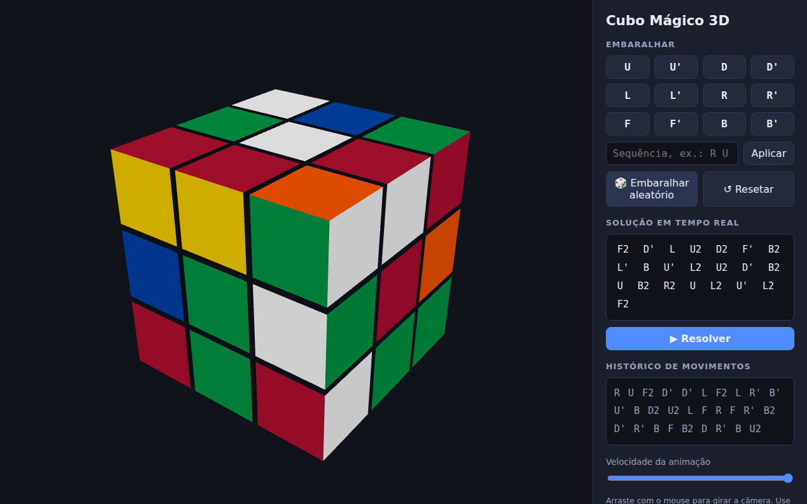

# Cubo Mágico 3D — Resolvedor

App web que exibe um cubo mágico 3x3 em 3D, permite embaralhá-lo livremente e
mostra a solução em tempo real, com animação passo a passo.



## Funcionalidades

- **Cubo 3D interativo** renderizado com Three.js — arraste para girar a
  câmera, use a roda do mouse para aproximar.
- **Embaralhe como quiser**: botões para cada giro (U, U', D, D', L, L', R,
  R', F, F', B, B'), campo para aplicar sequências na notação padrão
  (ex.: `R U R' U'`) e botão de embaralhamento aleatório.
- **Solução em tempo real**: a cada movimento, o app recalcula e exibe a
  sequência que resolve o estado atual do cubo (algoritmo two-phase de
  Kociemba, via [cubejs](https://github.com/ldez/cubejs), executado em um Web
  Worker para não travar a interface).
- **Resolver animado**: o botão "Resolver" executa a solução no cubo 3D,
  destacando o movimento atual.
- Histórico de movimentos e controle de velocidade da animação.

## Como rodar

É um site estático — basta servir a pasta por HTTP (módulos ES e Web Workers
não funcionam via `file://`):

```bash
python3 -m http.server 8080
# ou
npx serve .
```

Depois abra <http://localhost:8080> no navegador. Na primeira carga, o solver
leva alguns segundos para inicializar as tabelas de busca.

## Estrutura

```
index.html      — página e layout da interface
css/style.css   — estilos
js/main.js      — cena 3D, animação dos giros, fila de movimentos e UI
vendor/         — dependências versionadas (Three.js, OrbitControls, cubejs)
```

O estado lógico do cubo é mantido por uma instância de `Cube` (cubejs) que
recebe os mesmos movimentos aplicados ao cubo 3D; o solver roda em
`vendor/worker.js`.
