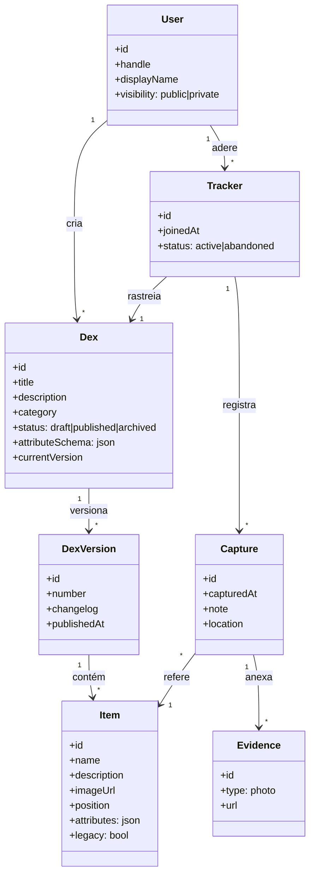
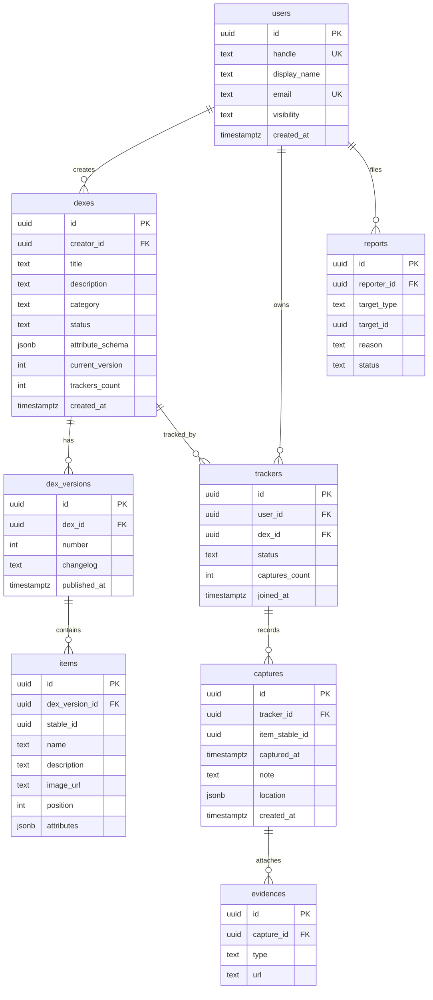

# 03 — Domínio e Dados

## 1. Linguagem ubíqua

Termos canônicos usados em código, API, banco e UI. Manter consistência é regra de projeto.

| Termo | Definição |
|---|---|
| **Dex** | Lista-modelo publicada por um criador. Tem versões. Sinônimo proibido: "lista", "coleção" (ambíguos). |
| **Item** | Entrada de uma Dex (uma ave, um local, um disco). Pertence a uma versão da Dex. |
| **Versão de Dex** | Snapshot imutável do conjunto de itens. Editar uma Dex publicada gera nova versão. |
| **Tracker** | A adesão de um usuário a uma Dex: seu progresso pessoal. Um usuário tem no máximo 1 tracker por Dex. |
| **Captura** | Registro de que o usuário obteve/visitou/concluiu um item, com evidências opcionais. |
| **Evidência** | Anexo de uma captura: foto, nota, data do evento, local. |
| **Categoria** | Taxonomia fixa do app (Natureza, Viagem, Colecionáveis, Mídia, Gastronomia, Outros) para descoberta. |
| **Esquema de atributos** | Campos extras definidos pelo criador para os itens daquela Dex (ex.: "raridade", "região"). |

## 2. Modelo de domínio

### Decisões de modelagem

1. **Versionamento de Dex (a decisão mais importante do domínio).** O progresso de milhares de usuários depende da estabilidade dos itens. Por isso:
   - Itens pertencem a uma `DexVersion`; cada item carrega um `stableId` que persiste entre versões (o mesmo pássaro na v1 e na v2 tem o mesmo `stableId`).
   - `Capture` referencia o `stableId`, não a linha da versão — capturas sobrevivem a atualizações da Dex.
   - Item removido em versão nova vira `legacy = true` no tracker de quem já o capturou: continua contando no histórico, sai do denominador do progresso da versão atual.
2. **Tracker como agregado de progresso.** Toda escrita de captura passa pelo tracker (raiz de agregado), o que centraliza invariantes: não capturar item de Dex não aderida, não duplicar captura do mesmo `stableId`.
3. **Esquema de atributos flexível, validado.** `attributeSchema` é um JSON Schema simplificado definido pelo criador; `Item.attributes` é validado contra ele. Evita uma tabela EAV e mantém flexibilidade.
4. **Progresso é derivado, nunca armazenado como fonte de verdade.** `progresso = capturas válidas / itens não-legacy da versão atual`. Pode ser cacheado/desnormalizado para ranking, com recálculo idempotente.

## 3. Modelo de dados (relacional)

**Restrições-chave:**
- `UNIQUE (trackers.user_id, trackers.dex_id)` — uma adesão por usuário/Dex.
- `UNIQUE (captures.tracker_id, captures.item_stable_id)` — sem captura duplicada.
- `UNIQUE (items.dex_version_id, items.stable_id)` — um stableId por versão.
- `trackers_count` e `captures_count` são contadores desnormalizados mantidos transacionalmente (evita COUNT em listagens e rankings).

## 4. Regras de negócio centrais

| # | Regra |
|---|---|
| R1 | Só o criador edita/publica/arquiva sua Dex. |
| R2 | Publicar exige ≥ 1 item; Dex em rascunho é invisível na busca. |
| R3 | Nova versão nunca apaga capturas; remoção de item ⇒ `legacy` para quem capturou. |
| R4 | Capturar exige tracker ativo na Dex e item existente na versão corrente (ou legacy já capturado — idempotência na sincronização offline). |
| R5 | Desfazer captura é permitido a qualquer momento e apaga as evidências associadas. |
| R6 | Abandonar Dex: usuário escolhe entre manter tracker inativo (histórico preservado) ou exclusão definitiva. |
| R7 | Foto de evidência só fica pública se o perfil do usuário for público E a foto passar na verificação de conteúdo. |
| R8 | Exclusão de conta: dados pessoais apagados; Dexes publicadas com aderentes são transferidas para "criador anônimo" (preserva o bem comum) — informado nos termos de uso. |
