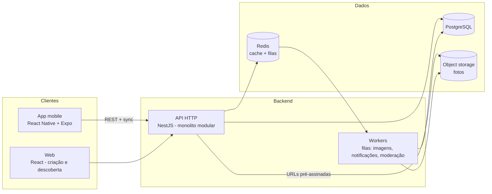

# 04 — Arquitetura

## 1. Princípios

1. **Simplicidade primeiro:** monolito modular + um app multiplataforma. Microsserviços só quando uma dor real exigir.
2. **Local-first no cliente:** capturas escrevem localmente e sincronizam — o requisito de offline (viagens, natureza) molda a arquitetura, não é um acessório.
3. **Fronteiras de módulo = fronteiras do domínio:** módulos `identity`, `catalog` (Dex/itens), `tracking` (trackers/capturas), `discovery` (busca), `trust` (denúncias/moderação). Comunicação entre módulos por interfaces, preparando extração futura se necessário.
4. **Decisões registradas:** toda decisão estrutural vira um ADR em `docs/adr/`.

## 2. Visão geral



## 3. Stack proposta (com justificativa)

| Camada | Escolha | Por quê |
|---|---|---|
| Mobile | **React Native + Expo** | Um codebase iOS/Android; Expo acelera build/distribuição; ecossistema maduro de SQLite local para offline |
| Web | **React (Vite)** compartilhando pacotes TS com o mobile | Criação de listas é melhor no desktop; reuso de tipos e lógica em monorepo |
| Backend | **Node.js + NestJS (TypeScript)** | Linguagem única no stack inteiro (tipos compartilhados da API ao app); NestJS impõe modularidade alinhada ao princípio 3 |
| Banco | **PostgreSQL** | Relacional com JSONB cobre o esquema flexível de atributos; full-text search nativo adia a necessidade de um motor de busca dedicado |
| Cache/filas | **Redis + BullMQ** | Processamento assíncrono (thumbnail, verificação de imagem, notificação) sem novo sistema |
| Storage | **S3-compatível** | Upload direto do cliente com URL pré-assinada; CDN na frente |
| Auth | **Provedor gerenciado (ex.: Auth0/Supabase Auth/Firebase Auth)** | Login social, recuperação de senha e MFA sem custo de manutenção próprio no MVP |
| Infra | **PaaS no MVP (ex.: Railway/Fly.io/Render) + IaC simples** | Foco no produto; migração para nuvem maior só com tração |
| Monorepo | **pnpm workspaces + Turborepo** | `apps/mobile`, `apps/web`, `apps/api`, `packages/shared` (tipos, validação zod, client da API) |

*As escolhas são recomendações com alternativas equivalentes; o que é inegociável são os princípios (monolito modular, TS ponta a ponta, offline-first).* 

## 4. API (contrato resumido)

REST com versionamento de URL (`/v1`). Contrato definido em OpenAPI; client TypeScript gerado em `packages/shared`.

```
Auth      POST /v1/auth/...                     (delegado ao provedor)

Dexes     GET    /v1/dexes?query&category&sort   busca/descoberta
          POST   /v1/dexes                       criar rascunho
          GET    /v1/dexes/:id                   detalhe + versão corrente
          PATCH  /v1/dexes/:id                   editar metadados (criador)
          POST   /v1/dexes/:id/versions          publicar nova versão (criador)
          POST   /v1/dexes/:id/items:bulk        importação em lote (criador)

Trackers  POST   /v1/dexes/:id/trackers          aderir
          GET    /v1/me/trackers                 minhas Dexes + progresso
          DELETE /v1/trackers/:id?keepHistory=   abandonar (R6)
          GET    /v1/dexes/:id/leaderboard       ranking (perfis públicos)

Capturas  PUT    /v1/trackers/:id/captures/:stableId    capturar (idempotente)
          DELETE /v1/trackers/:id/captures/:stableId    desfazer
          POST   /v1/captures/:id/evidences             anexar (retorna URL pré-assinada)

Sync      POST   /v1/sync/captures               lote offline: lista de operações
                                                 com IDs idempotentes e timestamps

Trust     POST   /v1/reports                     denunciar
          GET    /v1/me/export                   exportação LGPD
          DELETE /v1/me                          exclusão LGPD (R8)
```

### Sincronização offline (o ponto técnico mais delicado)

- Cliente mantém fila local (SQLite) de operações `capture`/`uncapture`, cada uma com UUID gerado no cliente e `capturedAt` do momento real.
- `PUT` idempotente por `(trackerId, stableId)`: replays são inofensivos.
- Conflito é trivial por natureza do domínio (o dado é do próprio usuário; última operação por timestamp vence). Não é necessário CRDT.
- Leituras: Dexes aderidas são cacheadas integralmente no dispositivo na adesão.

## 5. Decisões registradas (ADRs iniciais)

| ADR | Decisão | Alternativa rejeitada e motivo |
|---|---|---|
| 001 | Monolito modular | Microsserviços: custo operacional injustificável pré-tração |
| 002 | React Native + Expo | Nativo duplo: dobra o custo; Flutter: quebraria o TS ponta a ponta |
| 003 | PostgreSQL com JSONB para atributos | MongoDB: perderíamos integridade relacional das invariantes (unicidades de tracker/captura) |
| 004 | Capturas referenciam `stableId` versionado | Referência direta ao item: capturas quebrariam a cada versão de Dex |
| 005 | Sync por fila idempotente, sem CRDT | CRDT: complexidade desproporcional — não há edição concorrente do mesmo dado |
| 006 | Busca com Postgres FTS no MVP | Elasticsearch/Meilisearch: adiado até a busca virar gargalo medido |

## 6. Qualidade de engenharia

- **Testes:** pirâmide — unidade nas regras de domínio (R1–R8 todas testadas), integração na API com banco real (Testcontainers), E2E nos 3 fluxos críticos (publicar Dex, aderir+capturar, sync offline).
- **CI/CD:** lint + typecheck + testes em cada PR; deploy contínuo do backend em staging; mobile via canais EAS (preview por PR, produção por tag).
- **Migrações de banco:** versionadas e aplicadas no deploy, sempre retrocompatíveis (expand → migrate → contract).
- **Feature flags** para lançamentos graduais (badges, leaderboard).
- **Observabilidade:** logs estruturados com correlação por request; eventos de produto (`dex_published`, `tracker_joined`, `item_captured`) em pipeline de analytics desde o MVP — as hipóteses H1–H4 do doc 01 dependem deles.
